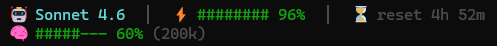

# Claude Code Statusline

> A live, color-coded status bar for [Claude Code](https://claude.ai/code) on Windows — showing your active model, session usage, context window, and time until reset at a glance.

---

## What it looks like



The bar updates live with every message you send. When limits get critical:

```
  🤖 Claude Opus 4.7   │   ⚡ ##------ 28%   │   ⏳ reset 47m
  🧠 ##------ 22% (44k)   │   ⚠️  compact soon
```

---

## What each indicator means

| Indicator | Description |
|-----------|-------------|
| 🤖 **Model** | The Claude model currently active in your session |
| ⚡ **Session bar** | Remaining capacity in your 5-hour usage window |
| ⏳ **Reset countdown** | Time until your 5-hour window resets |
| 🧠 **Context bar** | Remaining context window space, with token count |
| ⚠️ **Compact warning** | Appears when context is >80% full |
| 📅 **Weekly bar** | Appears only when your 7-day usage is >80% |

**Bar colors:**
- 🟢 Green — more than 60% remaining
- 🟡 Yellow — 30–60% remaining
- 🔴 Red — less than 30% remaining

---

## Requirements

- Windows 10 or 11
- [Claude Code](https://claude.ai/code) installed
- [Git for Windows](https://git-scm.com) (provides Git Bash)
- [jq](https://jqlang.github.io/jq/) (JSON processor)

> The installer will automatically install Git and jq via `winget` if they are not already present.

---

## Quick Install / Uninstall

Open **PowerShell** and run:

```powershell
irm https://raw.githubusercontent.com/LucieFairePy/Claude-Code-StatusLine/main/setup.ps1 | iex
```

A menu will appear — choose **[1] Install** or **[2] Uninstall**. Restart Claude Code after either action.

---

## Manual Install

1. Clone the repository:

   ```powershell
   git clone https://github.com/LucieFairePy/Claude-Code-StatusLine.git
   cd Claude-Code-StatusLine
   ```

2. Run the setup script:

   ```powershell
   .\setup.ps1
   ```

3. Choose **[1] Install** and restart Claude Code.

---

## How it works

Claude Code supports a custom `statusLine` command in `~/.claude/settings.json`. When configured, Claude Code pipes a JSON payload to your command after every exchange — containing model info, token counts, rate limit stats, and timing data.

This project provides:

- **`statusline-command.sh`** — A Bash script that reads the JSON, formats it into two colored lines, and prints them to stdout.
- **`statusline-wrapper.ps1`** — A PowerShell shim that bridges Claude Code (which calls PowerShell) to Git Bash (which runs the `.sh` script).

The installer patches `~/.claude/settings.json` to register the wrapper:

```json
{
  "statusLine": {
    "type": "command",
    "command": "powershell -NoProfile -NonInteractive -File \"C:\\Users\\<you>\\.claude\\statusline-wrapper.ps1\""
  }
}
```

---

## Customization

All display logic lives in `~/.claude/statusline-command.sh`. Open it in any text editor to tweak:

### Change bar width

```bash
make_bar() {
  local pct="$1" width=8   # change 8 to any number
```

### Change color thresholds

```bash
bar_color() {
  local pct="$1"
  if   [ "$pct" -ge 60 ]; then printf "\033[32m"
  elif [ "$pct" -ge 30 ]; then printf "\033[33m"
  else                          printf "\033[31m"
```

### Always show weekly usage

Remove the `if [ "$week_used_int" -ge 80 ]` guard at the bottom of the script:

```bash
col=$(bar_color "$week_left")
bar=$(make_bar "$week_left")
line2="${line2}  ${SEP}  📅 ${col}${bar} ${week_left}%${RESET}"
```

### Hide the weekly indicator entirely

Delete the entire weekly usage block at the bottom of the script.

---

## Troubleshooting

**Status bar doesn't appear after install**
- Restart Claude Code completely (close and reopen).
- Check that `~/.claude/settings.json` contains a `statusLine` key.

**`bash.exe` not found**
- Reinstall [Git for Windows](https://git-scm.com) and make sure "Git Bash" is included.
- The wrapper checks three common install paths automatically.

**`jq` command not found**
- Install jq manually: `winget install jqlang.jq`
- Or download from [jqlang.github.io/jq](https://jqlang.github.io/jq/)

**All bars show `--------`**
- Normal on the very first message. The bar populates once Claude Code sends its first JSON payload.

**PowerShell execution policy error**
- Run: `Set-ExecutionPolicy -Scope CurrentUser RemoteSigned`

---

## Uninstall

Re-run the setup script and choose **[2] Uninstall**:

```powershell
irm https://raw.githubusercontent.com/LucieFairePy/Claude-Code-StatusLine/main/setup.ps1 | iex
```

---

## License

MIT — see [LICENSE](LICENSE).
